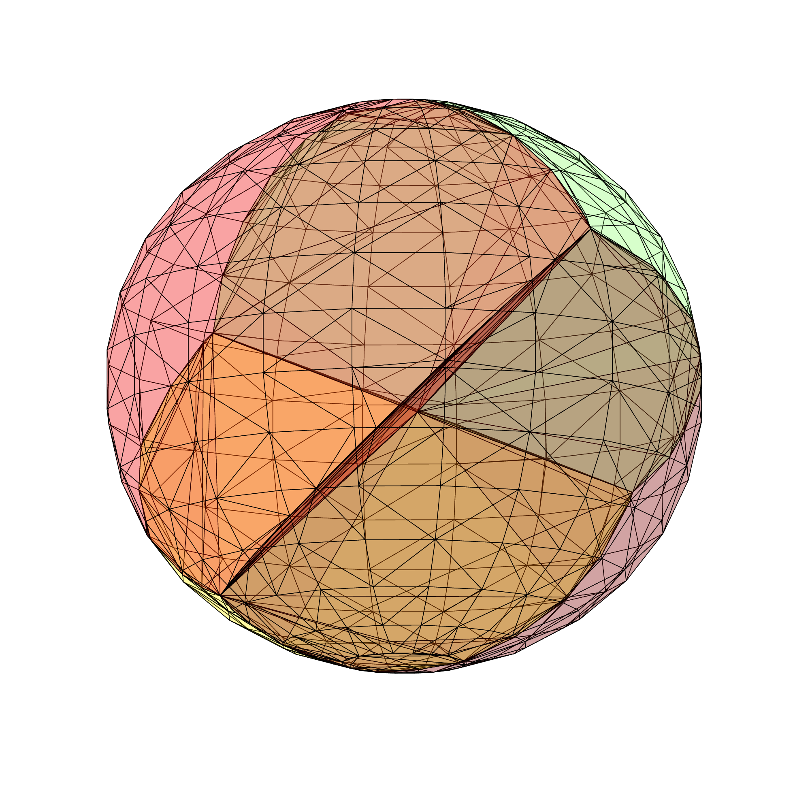
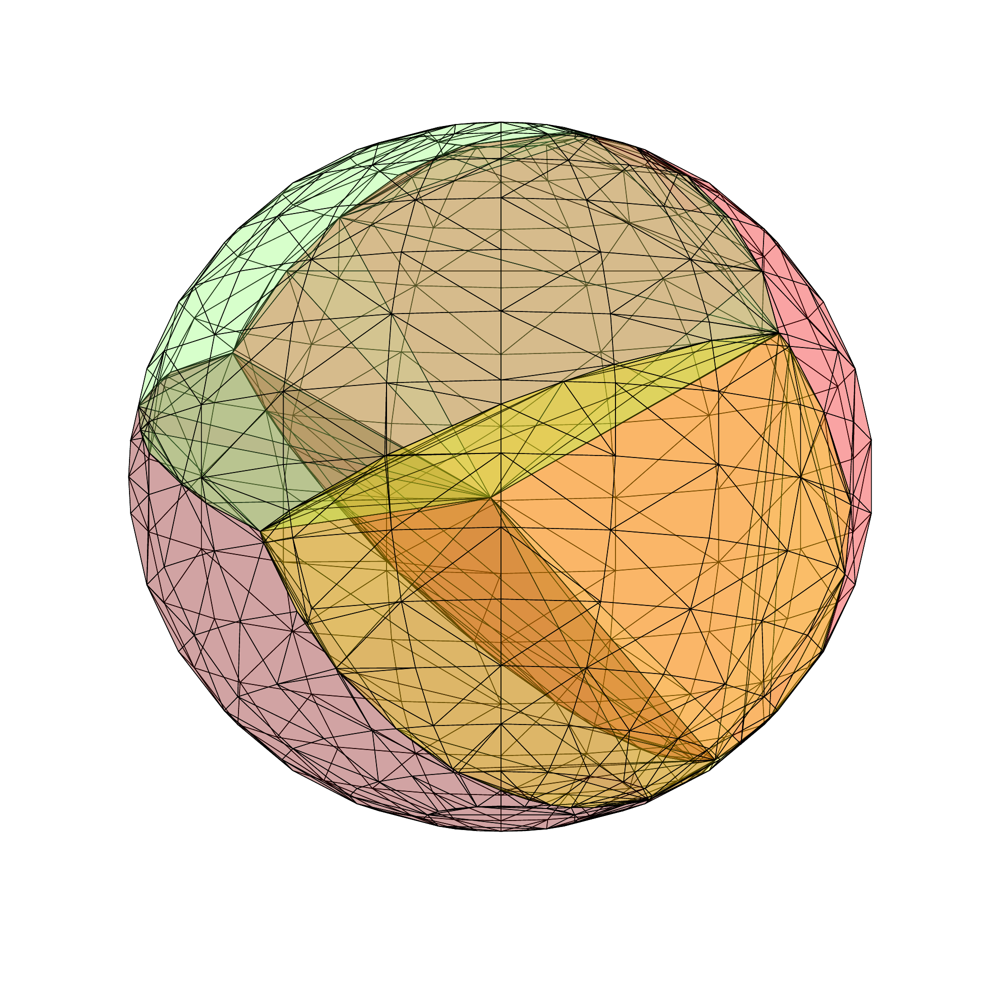
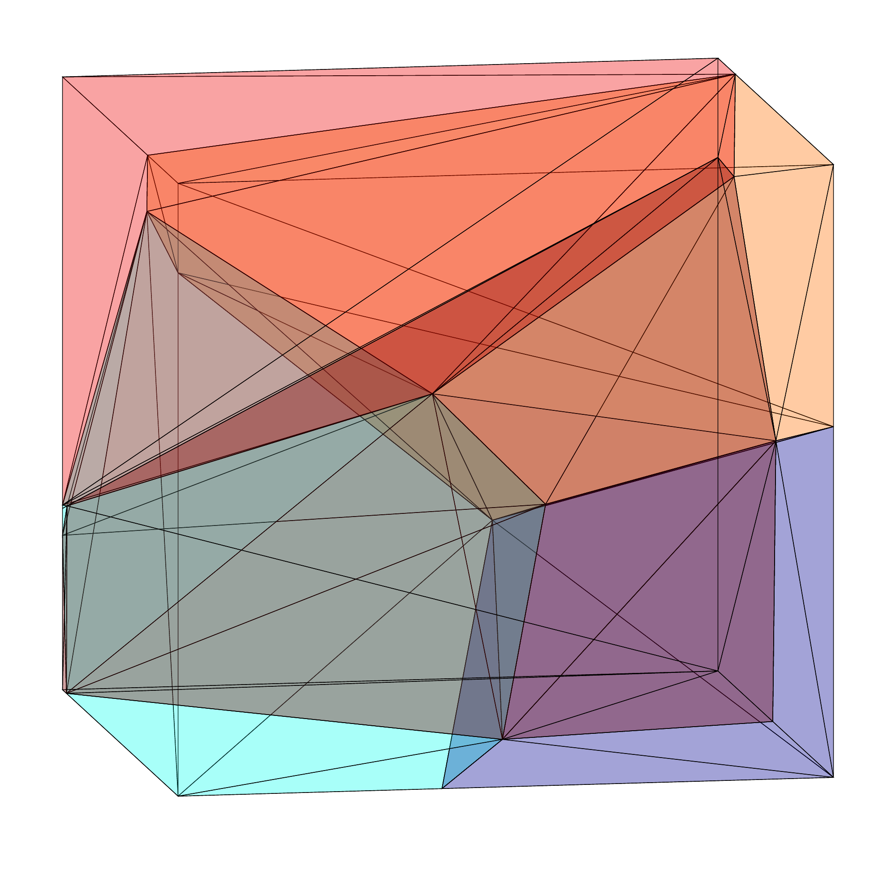
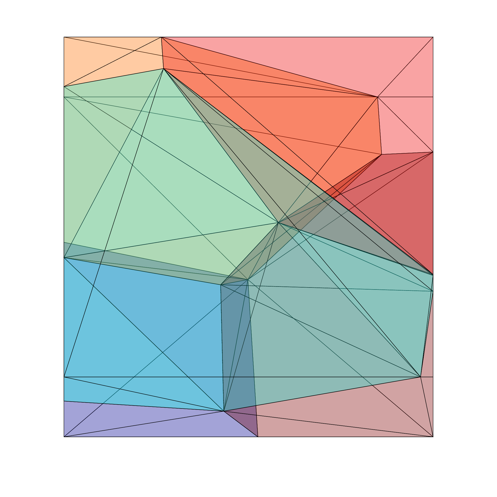

# Voronoi 3D
This code allows the construction of bounded 3D Voronoi diagrams inside an arbitrary polytope. 

Given a set of seeds, the code first constructs the corresponding Delaunay triangulation using an iterative insertion flipping algorithm. Next, the dual Voronoi diagram is extracted. It is implemented in such a way that the Voronoi diagram is automatically bounded inside a specified polytope.

